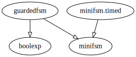
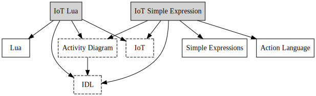

# Modular Language Composition for the Masses - Artifacts

Manuel Leduc, Thomas Degueule and Benoit Combemale

## Introduction

The Revisitor pattern is a language implementation pattern that enables independent extensibility of the syntax and  semantics of metamodel-based DSLs, with incremental compilation and without anticipation. It is inspired by the Object Algebra design pattern and adapted to the specificities of metamodeling.

On top of the Revisitor pattern, we introduce Alex , a high-level language for semantics specification of metamodels that compiles to Revisitors to support separate compilation of language modules.

Alex is tightly integrated with the Eclipse Modeling Framework (EMF) and relies on the Ecore meta-language for the definition of the abstract syntax of DSLs. Operational semantics is defined with Alex using an open-class-like mechanism.

Alex is bundled a set of Eclipse plug-ins.

In the current artifact,  we evaluate Alex in the development of a new DSL for IoT systems modeling resulting from the composition of three independently defined languages (UML activity diagrams, Lua, and the CORBA Interface Description Language).

## Artifacts

A table listing all the files and directories of the artifact exhaustively is located in [listing.md](./listing.md).

## Requirements

- [JDK 1.8](http://www.oracle.com/technetwork/java/javase/downloads/jdk8-downloads-2133151.html);
- Eclipse Photon for DSL developers ([4.8.0](https://www.eclipse.org/downloads/packages/eclipse-ide-java-and-dsl-developers/photonr)) + EcoreTools ([3.2.0](http://download.eclipse.org/ecoretools/updates/releases/3.2.0/neon)).

## Instructions

### Installing Alex

In Eclipse, `Help -> Install new Software...`, click on `Add...`, then `Archive...` and select the **archive.zip** file located at the root of the artifacts directory.
Finally, select the **Alex Feature** entry and follow the usual Eclipse installation steps.
Once Eclipse restarted, the Alex plugin is installed.

#### Examples

The examples presented in this section are not strictly related to the evaluation use case, but are simpler languages aimed at easing the understanding of Alex. The examples are simple introductory example, and do not make use of the language composition concepts studied in the paper.

###### Import

The examples are located in the `./examples` directory. They are regular Eclipse plugins and can be imported by the usual `File → Import... → Existing Projects into Workspace` then selecting the `examples` directory in the `Select root directory` field and clicking on `Finish`.

###### Structure

Each example is structured the same way, with a `model` directory containing an `ecore` file describing the abstract syntax of the language, and a `semantics` directory containing `ale` files implementing its semantics.

The `src` and `src-gen` directories contains java sources derived from the abstract syntax and semantics definitions. Revisitor interfaces can be re-generated by right-clicking an Ecore file -> `ALE` -> `Generate Revisitor Interface`. Revisitor implementations are automatically re-generated whenever an `.ale` file is saved.

Each project contains a `Main.java` class which executes a small program.

###### Languages descriptions

* The `boolexp` and `minifsm` examples are standalone languages, respectively showing a boolean expressions language and a minimal Finite State Machine language.
* The `minifsm.timed` example extends the `minifsm` with the notion of time.
* The `guardedfsm` language reuses both the `boolexp` and `minifsm` languages to define a Finite State Machine language with boolean guards on transitions.




#### Use Cases

This section describes the implementation of the languages presented in Section 5 of the paper.

##### IoT Lua Language

The IoT Language is build by composing the IoT Language concern with an Activity Diagram, IDL and Lua language concerns.

`./iot/iot.lua.model/model/iot_lua.ecore` composes the language concerns abstract syntaxes to form the IoT Lua abstract syntax.

`./iot/iot.lua.ale/src/iot_lua.ale` composes the language concern semantics, mostly by translation of the different semantics parameters.

For instance,  `ExpressionBindStatement` creates a new Lua environment, complete it with the Activity Diagram context and calls the delegated statement execute method.

Finally, it reports back the updates of the environments by the execute call to the Activity Diagram context.

##### IoT Simple Expression Language

The IoT Simple Expression Language follows the same composition methodology, but using two smaller languages instead of Lua.

##### Running the languages

Both languages execute an illustrating use case: a simulated IoT system which keeps track of the temperature and luminosity of an environment.

The same program is run for each language, but they are parsed by different Xtext grammar before being executed with their respective semantics.

The execution is done by running the unit test of the test classes (Right click `Run as → JUnit Plug-in Test`):

- **Iot Lua Language Test class:** `/iot.lua.xtext.tests/src/iot/lua/xtext/tests/IotLuaXtextExecutionTest.xtend`
- **Iot Simple Expression Test class:** `/iot.simpleexpressions.xtext.tests/src/iot/simpleexpressions/xtext/tests/IoTExecutionTest.xtend`

Random values are produced during the execution, leading to nondeterministic execution logs, but an expected result looks like:

```text
bind temp to 0
bind lumen to 0
bind tempThreshold to 21
bind lumenThreshold to 1600
bind i to 0
bind one to 1
bind nbIter to 15
bind waitingTime to 500
bind temp to 19
assign temp = 19
[...]
```

##### Testing the IoT Languages

- From the current eclipse instance, start a new eclipse: `Run → Run configurations...`
- On the run configuration window: `Right click on "Eclipse Application" on the left pane → New Configuration` then click Run at the bottom right.
- On the newly started eclipse, create a new project.
- Create a file with the `.iot_lua` or `.iot_se` extension, click yes when a pop-up asks for the conversion to Xtext project.
  - You can either start from the minimal example provided below (compatible with `.iot_lua` and `.iot_se`) or by copying `/iot/iot.lua.xtext.tests/usecase.iot_lua` or `/iot/iot.simpleexpressions.xtext.tests/usecase.iot_se`

```
system MySystem {
	sketch {
		activity Test {
			nodes {
				initial i out (e0),
				final f in (e0)
			}
			edges {
				flow e0 from i to f
			}
		}
	}
}
```


**Note:** Testing the execution has not been integrated but the test proposed in `/iot/iot.lua.xtext.tests` and `/iot/iot.simpleexpressions.xtext.tests` can help to do it programmatically.

##### Conclusion



The dependency graph presents a bird's eye view of the languages and language concerns dependencies.

The dashed rectangles are language concerns shared between our two IoT Languages (represented by grey rectangles).

This highlights the reuse offered by our approach to language concerns composition.

### Building Alex

#### Compilation

In eclipse, importing the Eclipse Plug-ins of the `/plugins` directory.

The named following the pattern `ale.xtext*` are part of the Alex Xtext language and can be developed following the rules of standards of the Xtext framework (Cf the [official documentation](https://www.eclipse.org/Xtext/documentation/index.html)).

The compilation is by default done incrementally by Eclipse, but starting a full compilation can be execute by selecting the `Project -> Clean...` menu entry, the checking `Clean all project` and finally clicking `Clean`.

One the triggered eclipse tasks finished, the projects opened in the workspace are rebuild.

#### Creating an installation archive

- Open the `site.xml` file in the `ale.p2updatesite` project then click on `Build All`.
- Create a zip archive with the `features` directory, the `plugins` directory, `artifacts.jar`, and `content.jar`.

## Known Issue

While the following issue is not a consequence of our artifact, it can get in the way during the artifact evaluation.

### Builtin LFS support not present/detected

If some log alike the extract below are polluting the Console, please install the latest EGit version as advised [here](https://bugs.eclipse.org/bugs/show_bug.cgi?id=536516).

The EGit update site is located at [http://download.eclipse.org/egit/updates/](http://download.eclipse.org/egit/updates/), the item to update is "Git integration  for Eclipse"

**Error Log sample:**

```text
!ENTRY org.eclipse.egit.core 2 0 2018-08-29 11:19:13.377
!MESSAGE Builtin LFS support not present/detected
!STACK 0
java.lang.ClassNotFoundException: org.eclipse.jgit.lfs.BuiltinLFS cannot be found by org.eclipse.egit.core_5.0.0.201806131550-r
	at org.eclipse.osgi.internal.loader.BundleLoader.findClassInternal(BundleLoader.java:508)
	at org.eclipse.osgi.internal.loader.BundleLoader.findClass(BundleLoader.java:419)
	at org.eclipse.osgi.internal.loader.BundleLoader.findClass(BundleLoader.java:411)
```
